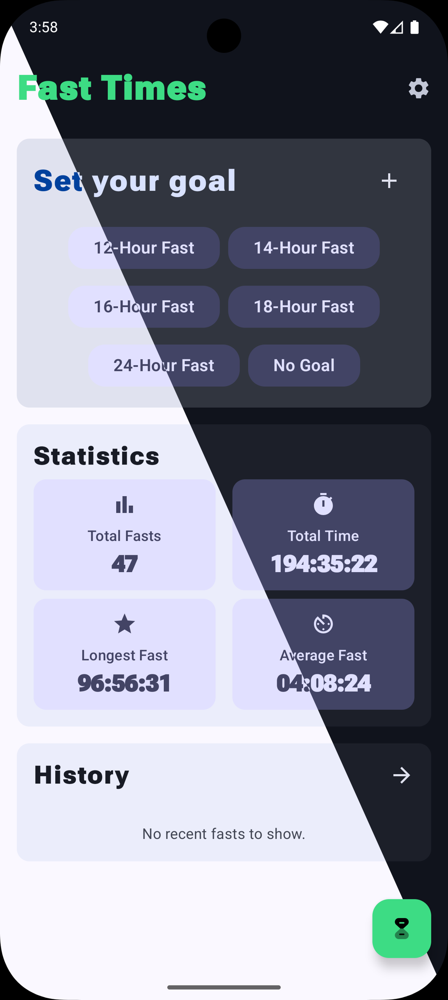
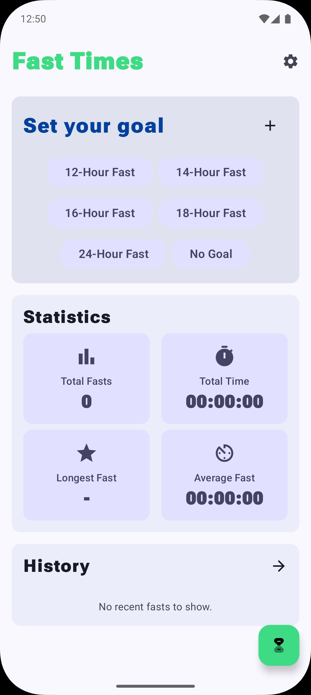
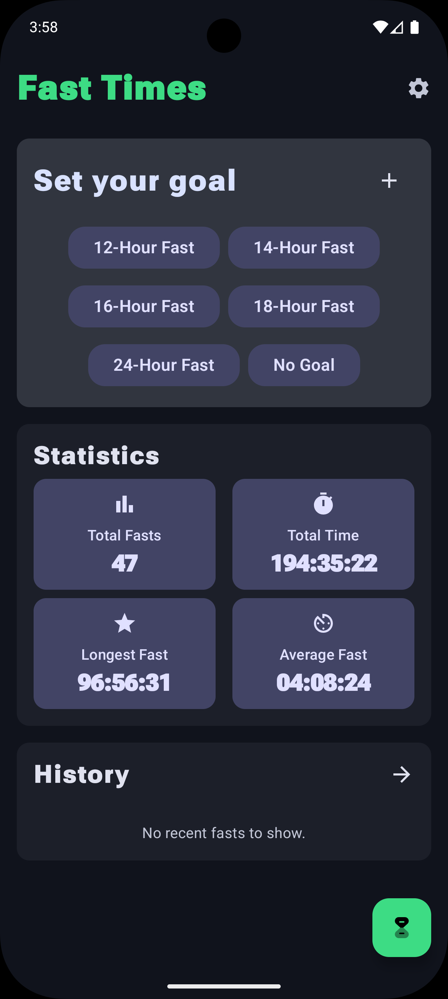
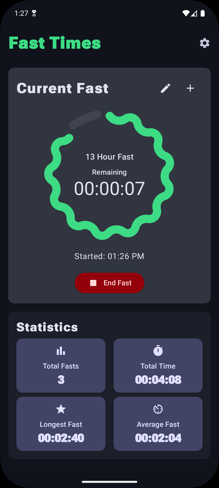
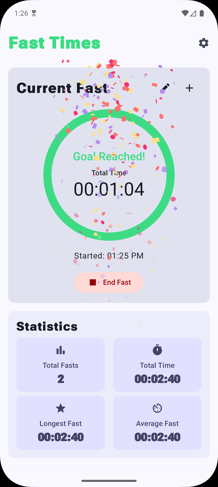
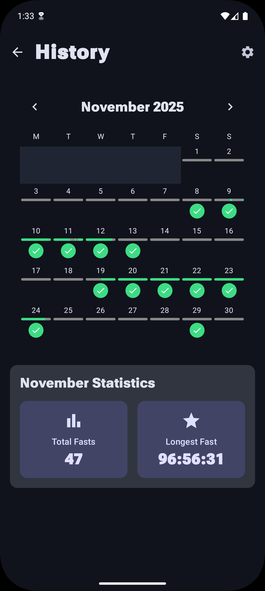
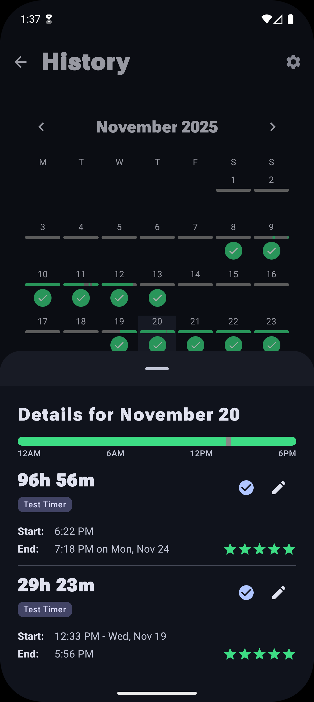
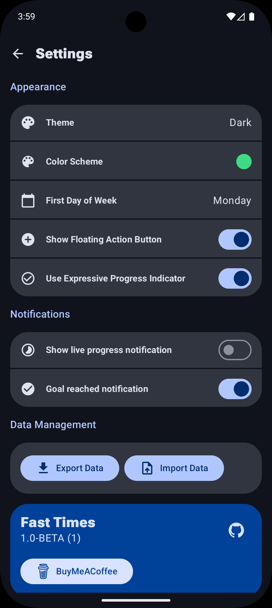

# FastTimes

A simple Open Source Android fasting timer and tracking app.

## Screenshots

<p width="100%" align="center">
  
  
  
  
  
  
  
  
</p>

## Download
The latest stable version of FastTimes is available on GitHub.

<p>
  <a href="https://github.com/tom-murphy-development/fasttimes/releases">
    
  </a>
</p>

### Coming Soon
FastTimes will soon be available on the following stores:

<p>
  <a href="#">
    
  </a>
  <a href="#">
    
  </a>
</p>

## Features
---
### ⏱️ Intermittent Fast Tracking
*   **Intuitive Timer**: Start, stop, and adjust your fasts with a single tap. A persistent background service ensures your progress is tracked accurately, even if the app is closed or the device restarts.
*   **Flexible Fasting Goals**: Choose from standard intermittent fasting plans (16:8, 20:4, OMAD) or define a custom goal that fits your specific routine.
*   **Visual Progress**: Stay motivated with Material 3 Expressive countdowns and notifications.
*   **Comprehensive History**: Review past fasts with detailed logs and edit previous entries to keep your data accurate.
*   **Statistics**: Visualize your streaks and habits over time to better understand your progress.

### 🎨 Personalization
*   **Material 3 & Dynamic Colors**: A modern Material 3 interface (using Material 3 Expressive components) that supports "Material You," automatically adapting to your system wallpaper colors.
*   **Theming Support**: Seamlessly switch between light and dark themes for comfortable nighttime logging.
*   **UI Customization**: Tailor the app's look with adjustable accent colors and interface elements.

### 🛡️ Privacy First
*   **100% Offline**: FastTimes works entirely without an internet connection. Your data never leaves your device.
*   **No Accounts, No Tracking**: No email required, no cloud syncing, and absolutely no third-party analytics or trackers.
*   **Open Source**: Built with transparency in mind.
*   **Full Data Control**: You own your data. Export and Import your history as you wish.

### 🏗️ Modern Tech Stack
Built with the latest Android standards to ensure a high-performance, resilient experience:
*   **Jetpack Compose**: A fully declarative UI for fluid animations and a modern user experience.
*   **Kotlin Coroutines & Flow**: Powering reactive, non-blocking data streams throughout the app.
*   **Room & DataStore**: Robust local-first persistence; Room handles complex fasting logs while DataStore manages user preferences.
*   **Hilt DI**: Clean dependency injection for a modular, maintainable, and testable architecture.
*   **Clean Architecture (MVVM)**: Ensure the app is scalable and robust.


## Project Structure
```
app/src/main/java/com/fasttimes/
  ├── alarms/      # Alarm scheduling logic
  ├── data/        # Room database, DataStore, Repositories
  ├── di/          # Hilt Dependency Injection modules
  ├── receiver/    # BroadcastReceivers (e.g., BootCompleted)
  ├── service/     # Foreground services
  ├── ui/          # Jetpack Compose screens and components
  └── FastTimesApp.kt
```

## Build Instructions
1. **Clone the repository**:
   ```bash
   git clone https://github.com/tom-murphy-development/fasttimes.git
   ```
2. **Open in Android Studio**: Use **Ladybug (2024.2.1)** or newer for full support of the latest Compose features.
3. **JDK Configuration**: Ensure **JDK 17** is selected in *Settings > Build, Execution, Deployment > Build Tools > Gradle*.
4. **Build**: Run `./gradlew assembleDebug` or use the Play button in Android Studio.
5. **Run**: Deploy to an emulator or physical device running **Android 11 (API 30)** or higher.

## Contribution Guidelines
We welcome contributions! To keep the codebase clean and consistent:
- **Branching**: Fork the repository and create a descriptive feature branch (e.g., `feature/add-reminders`).
- **Target Branch**: Always submit Pull Requests against the `main` branch.
- **Code Style**:
    - Follow Kotlin and Jetpack Compose best practices.
    - This project uses **Spotless** for formatting. Run `./gradlew spotlessApply` before committing your changes.
- **Architecture**: Stick to the existing **MVVM** and **Hilt** patterns for UI and Dependency Injection.
- **Testing**: Where possible, add unit tests for new logic. Verify everything passes with `./gradlew test`.
- **PRs**: Provide a clear description of the changes and link any relevant issues.

## Donate
Help support the ongoing development of FastTimes through:

[](https://www.buymeacoffee.com/tommurphydp)

<!-- sponsors --><!-- sponsors -->

## License
This project is licensed under the **GNU General Public License v3.0**. See [LICENSE](LICENSE) for details.
